# Onshape

## Part 1 - Base
### Reflection
This was a really simple project but a great intro to this new software. This assignment really took me back to 8th grade when we originally made this.
### Picture
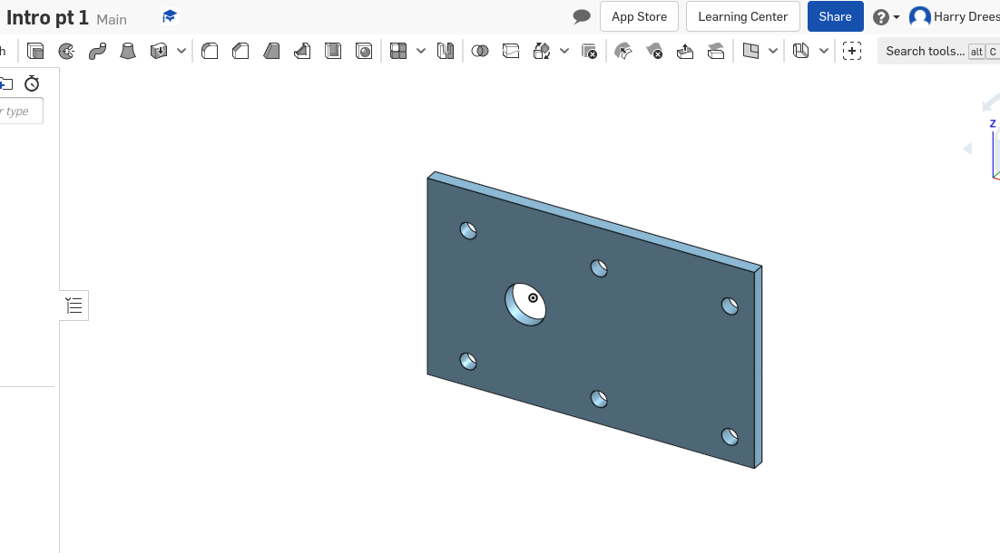
### Link
https://cvilleschools.onshape.com/documents/dd9e137a400ec50543663b99/w/2d3d5286343de1e33cb604b5/e/b17e1693f9ad84e55957b344

## Part 2 - Mount
### Reflection
Very simple but really went in depth on how many ways you can do the same assignment.
### Picture
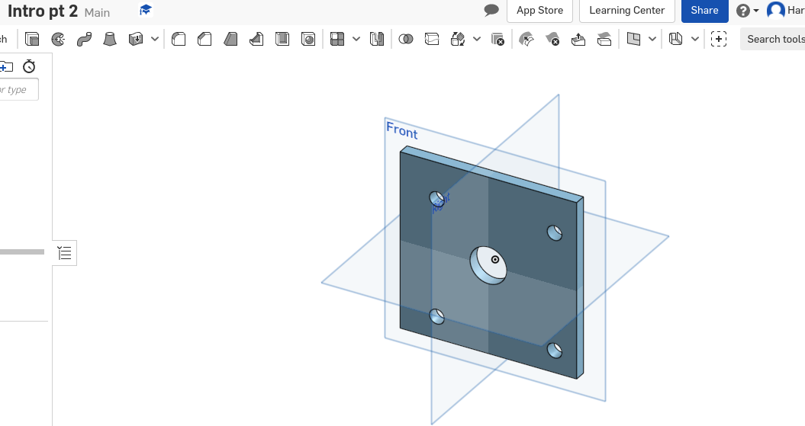
### Link
https://cvilleschools.onshape.com/documents/8e9da94086bd99d78a6b0069/w/6aad2dcac97a9a6e6c21cf3c/e/9ee27df6e6c19b2b86d10662

## Part 3 - Fork
### Reflection
This assignment is what puts onshape ahead of solid works for me, the shear simplicity and ease onshape makes this assignment is amazing.
### Picture
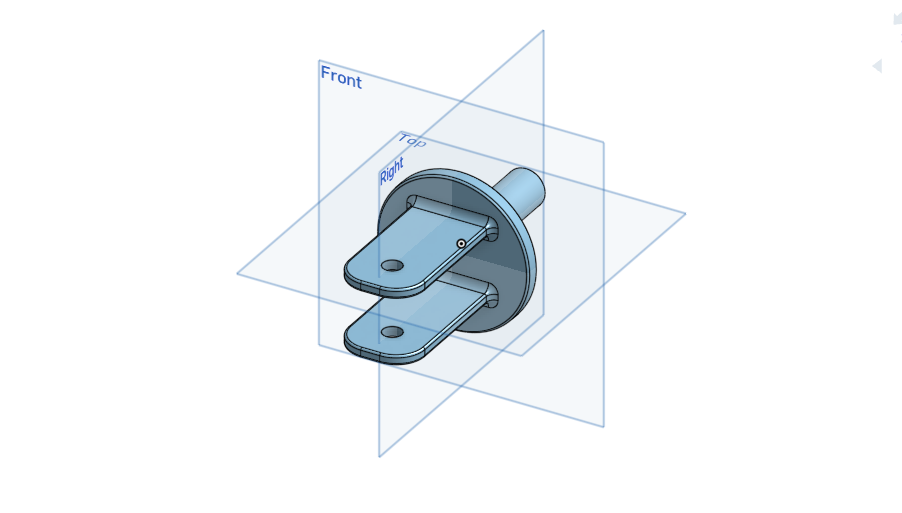
### Link
https://cvilleschools.onshape.com/documents/9a0205fd9ed5cedb940cac7c/w/e02cea1eb62e689da2d3357c/e/ca050824687afb496fff1a96

## Part 4 - Tire
### Reflection
I think these assignments are getting easier.
### Picture
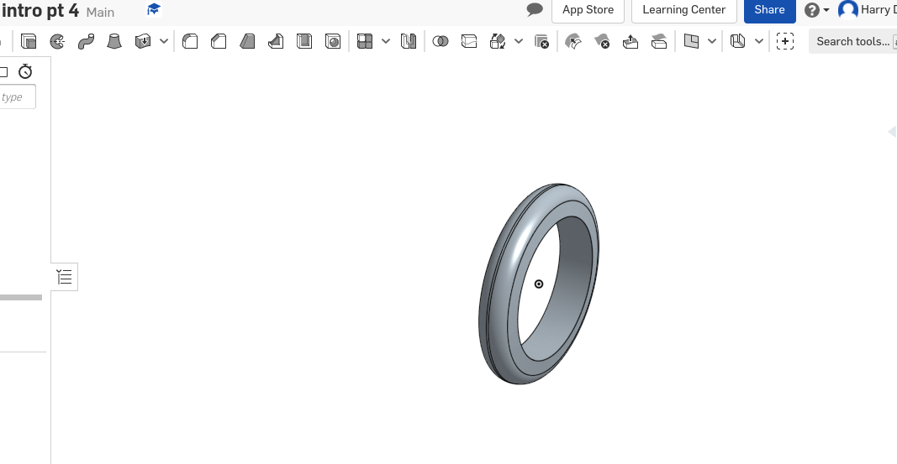
### Link
https://cvilleschools.onshape.com/documents/8dffab100e304b752475bc43/w/6d393c70cee17c5f760f9534/e/d52bad90fe6f2254405c48dc

## Part 5 - Wheel
### Reflection
The fillets on this software are out of this world and I am so shocked this is a web browser application.
### Picture
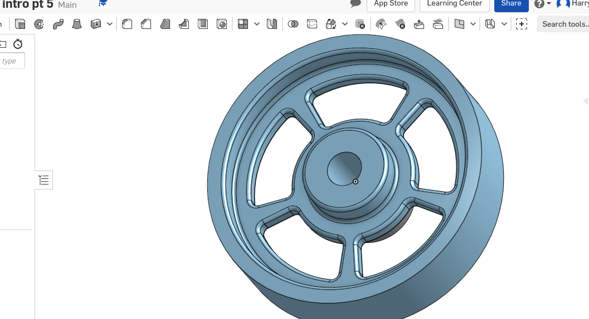
### Link
https://cvilleschools.onshape.com/documents/da224f53a88a21d1ea7128bd/w/b3f3d013a1e6d8a978390448/e/9eaf20e980fb1cde3a8cc7cf

## Part 6 - Axle
### Reflection
Super easy part that used cuts and mirrors.
### Picture
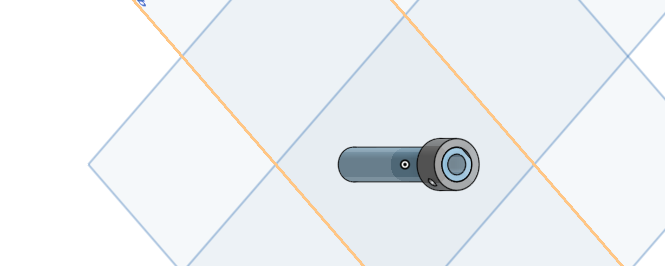
### Link
https://cvilleschools.onshape.com/documents/4220943636b49a3641977d5a/w/88d5f8ffaa51577ccdbc6e39/e/9e7913b3bb53f35d043c508d

## Part 7 - Collar
### Reflection
Introduces us to a new feature, the ability to create a part with already existing geometery.
### Picture
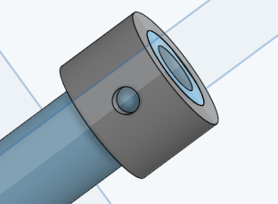
### Link
https://cvilleschools.onshape.com/documents/4220943636b49a3641977d5a/w/88d5f8ffaa51577ccdbc6e39/e/9e7913b3bb53f35d043c508d

## Part 8 - Bearing 1
### Reflection
Really simple part, similar to Collar it demonstrates how we can make a part with the geometry of another part.
### Picture
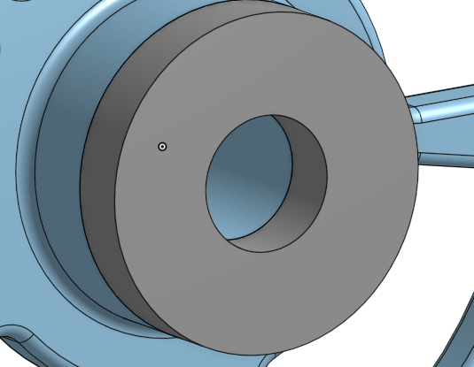
### Link
https://cvilleschools.onshape.com/documents/da224f53a88a21d1ea7128bd/w/b3f3d013a1e6d8a978390448/e/9eaf20e980fb1cde3a8cc7cf

## Part 9 - Bearing 2
### Reflection
Almost the exact same as bearing one but marks the end of creating the parts.
### Picture
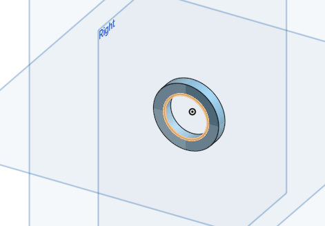
### Link
https://cvilleschools.onshape.com/documents/a218818f206caaa69ed9da27/w/a6d18c61ab4e32d29cf07181/e/33a8c835b829002644e12cf1

## Sub assembly
### Reflection
The shear simplicity of onshape and how the logic of the program works is crazy.
### Picture
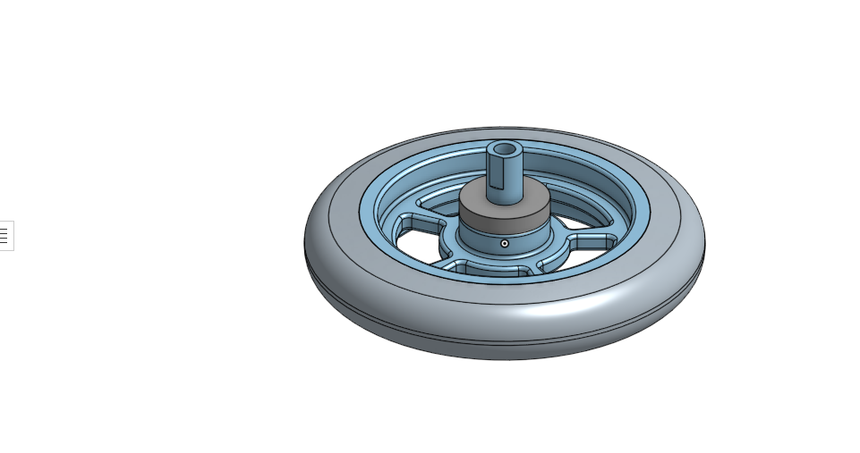
### Link
https://cvilleschools.onshape.com/documents/4ce51bb1eb9078c7012a4264/w/3129113209a09e530d913c37/e/56bcfb0bd66e9f51be24f038

## Final assembly
### Reflection
Probably the fastest I have ever finished a set of assignments but it was a great intro and I really like the program.
### Picture
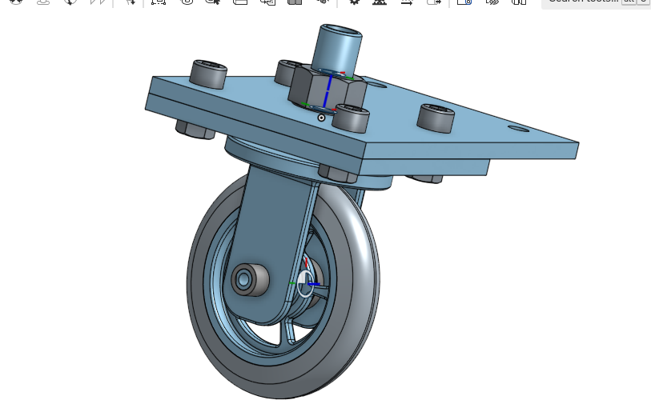
### Link
https://cvilleschools.onshape.com/documents/3ba79cd33e2ba07991c921ee/w/0120e4a60ea5576c48125031/e/981627ea0fb785bf6a936bf8

## Week Five Challenge

### Reflection
This was a struggle. I Breezed throught the first two parts and hit a major roadblock on the last part and the assembly. The mates for the assembly was super hard. But know I know how to use cylindrical mates.
### Picture
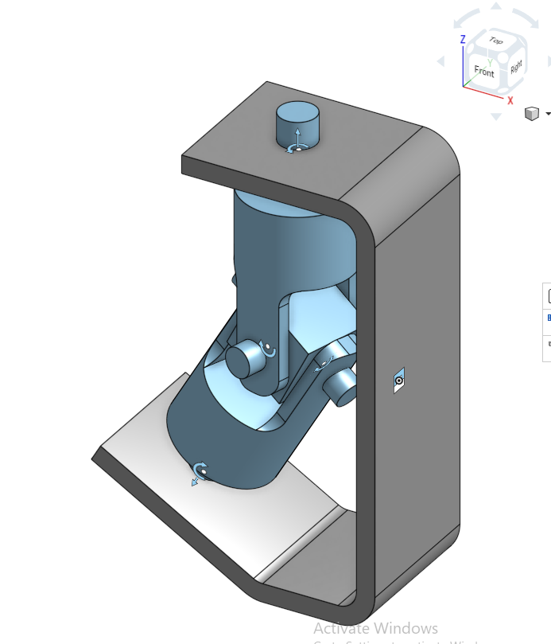
### Link
https://cvilleschools.onshape.com/documents/861a4a4979888b604e3633ab/w/f3e5daafccb4b42a8be9496f/e/afb105c28cbc447d7b839ddd
